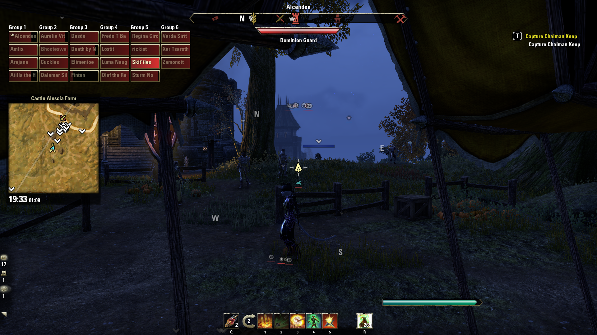

# Provinatus
Added an arrow that continuously points to the group leader to [Provision's Team Formation](http://www.esoui.com/downloads/info1135-ProvisionsTeamFormation.html) (a mod that displays teammates position and health on a heads-up display).

## Provision's Team Formation
If I could only run one mod in ESO it would be Provision's Team Formation. It makes it super easy to know what is going on with your group. 

## Currently, most code belongs to [Provinatus](http://www.esoui.com/forums/member.php?action=getinfo&userid=18354) and his/her original mod is hosted [here](http://www.esoui.com/downloads/info1135-ProvisionsTeamFormation.html) below is an excerpt from the description.
>TeamFormation is a user Interface for The Elder Scrolls Online, designed to show the positions and health of your teammates, like a radar. I'm happy to share my addon with you, but please don't make a fork of this addon without my authorization.
>
>I looking for German translation, and english checking for correct grammar and spelling of TeamFormation's settings. See this post.
>
>You can easily see the positions and health of your teammates :
>
>- Healers : See the position of damaged teammates so you can easily heal them.
>- Leader : See the position of your teammates so you can easily decide what orders to give.
>- Dps : See the position of teammates so you can stay near them.
>- Tank : See the position of Healers & Dps who take damage so you can regain agro.
>- All : See the position of dead teammates and their resurrection status.

## Provinatus
If I could only run 2 mods, it would be Team Formation and [Exterminatus Group Leader](http://www.esoui.com/downloads/info329-0.1.html). However, Group Leader stopped working for me and inspired me to delve into Lua and ESO modding by recreating some of the features I loved most about Exterminatus Group Leader.

 

## In the below screenshots, the part I created is the big arrow in the center of the screen. The rest of the HUD is Provision's work.

### I just spawned at a camp! Where the hell is crown? (The mini map is [Votan's Minimap](http://www.esoui.com/downloads/info1399-VotansMinimap.html))

### Indicator shows I am on headed towards crown

### You can see the crown icon is a little red as he takes damage

### Special thanks to Provision for letting me use their code. It was not trivial making the head's up display and it was implemented beautifully.
